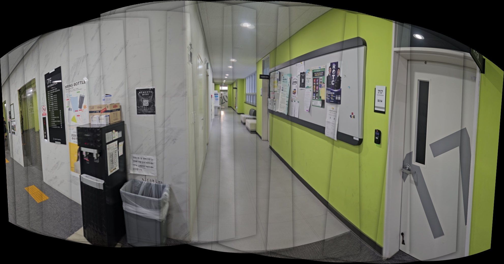
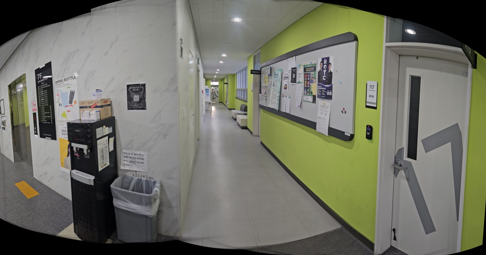
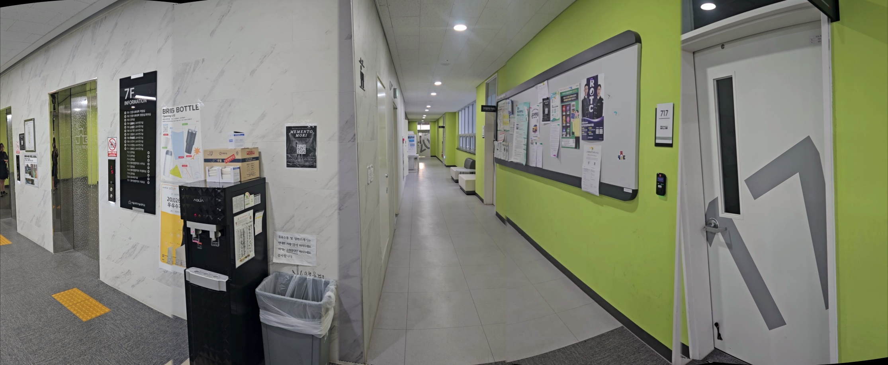

# my-image-stitcher
# video-panorama-stitching

동영상에서 프레임을 추출한 뒤, 여러 프레임을 자동으로 정합하여 하나의 넓은 파노라마 이미지를 생성하는 프로그램입니다.

OpenCV의 Stitcher와 같은 high-level API를 사용하지 않고,  
특징점 검출 → 매칭 → RANSAC → 투영 → 블렌딩 → 크롭까지 전 과정을 직접 구현하였습니다.

---

## 데모

### Input Video

  

<b>입력 영상</b>

---

### v1 Result (SIFT + Homography)

  

<b>기본 파노라마 결과 (ghost 및 seam 존재)</b>

👉 v1: 기본 구조 구현 단계

---

### v2 Result (Blending 개선)

  

<b>경계 부드러움 및 crop 개선</b>

👉 v2: 시각적 품질 개선 단계

---

### v3 Result (구조 개선)

  

<b>translation + keyframe + seam-cut 적용 (최종 결과)</b>

👉 v3: 알고리즘 구조 개선 단계

---

## 전체 파이프라인

~~~text
Video
 → Frame Extraction
 → Cylindrical Warping
 → Feature Matching
 → Motion Estimation
 → Image Placement
 → Blending
 → Crop
~~~

---

# v1 — SIFT + Homography 기반 구현

## 핵심

- SIFT 특징점 검출을 사용합니다.
- FLANN을 통해 특징점 매칭을 수행합니다.
- RANSAC으로 Homography를 추정합니다.
- 중앙 이미지를 기준으로 누적 정합을 수행합니다.
- Gaussian blending으로 이미지를 연결합니다.

## 문제점

- 이미지가 겹치는 영역에서 ghost가 발생합니다.
- 경계선이 눈에 띄는 문제가 있습니다.

---

# v2 — Blending 및 Crop 개선

## 추가 구현

- distance 기반 weight를 적용합니다.
- feather blending을 개선합니다.
- auto crop을 통해 검은 영역을 제거합니다.

## 개선 효과

- 경계가 보다 부드럽게 연결됩니다.
- 불필요한 검은 영역이 줄어듭니다.

---

# v3 — 구조 개선 (핵심 개선 단계)

## 핵심 변화

~~~text
Homography 기반 → Translation 기반으로 변경합니다.
~~~

## 변경 이유

~~~text
원통형 투영 이후에는 문제 구조가 “수평 이동”에 가까워지기 때문입니다.
~~~

---

## 주요 기능

- ORB 특징점 기반 매칭을 사용합니다.
- RANSAC을 통해 translation을 추정합니다.
- keyframe을 자동으로 선택합니다.
- seam-cut blending을 적용합니다.
- 색상 보정을 수행합니다.

---

## 핵심 아이디어

### Keyframe 선택

~~~text
프레임이 너무 많으면 ghost가 증가하고,
너무 적으면 중간이 끊어지는 문제가 발생합니다.

따라서 이동 거리 기반으로 적절한 keyframe을 선택합니다.
~~~

---

### Seam-cut blending

~~~text
기존: 전체 영역을 평균 → 이미지가 흐려짐
개선: 경계 부분만 blending → 선명도 유지
~~~

---

### 색상 보정

~~~text
Lab 색공간에서 평균을 맞춰 프레임 간 색 차이를 줄입니다.
~~~

---

# 실험 결과

| ratio | 결과 |
|------|------|
| 0.70 | 번짐 발생 |
| 0.78 | 가장 안정적인 결과 |
| 0.82 | 중간 영역 끊김 |

---

# 트러블슈팅

## 1. 프레임 수가 많으면 항상 좋을까?

그렇지 않습니다.

~~~text
프레임이 많을수록 overlap이 증가하고,
결과적으로 ghosting이 심해질 수 있습니다.
~~~

→ 해결: keyframe 선택 방식을 도입하였습니다.

---

## 2. 회전 보정 시도 실패

Affine 변환을 적용하여 회전 보정을 시도하였습니다.  
하지만 오히려 정렬 기준이 깨지면서 결과가 더 나빠졌습니다.

~~~text
회전 보정 → 정렬 불안정 → 결과 악화
~~~

→ 해결: 회전 보정을 제거하고 translation 기반 구조를 유지하였습니다.

---

## 3. ghost 완전 제거가 어려운 이유

~~~text
깊이 차이 (parallax) 때문입니다.
~~~

- 가까운 물체
- 먼 물체

이 두 영역은 서로 다른 움직임을 가지므로,  
하나의 변환으로 완벽히 맞추는 것이 어렵습니다.

---

# 추가 구현 사항

| 기능 | 적용 여부 |
|------|----------|
| cylindrical view | O |
| blending | O |
| crop | O |
| keyframe 선택 | O |
| seam blending | O |
| color 보정 | O |

---

# v4 확장 아이디어

이번 구현에서 완전히 해결되지 않은 ghosting 문제를 개선하기 위해  
다음과 같은 방향으로 확장이 가능합니다.

## 1. seam finding

~~~text
이미지 차이가 가장 작은 경로를 자동으로 선택
~~~

---

## 2. multi-band blending

~~~text
저주파/고주파를 분리하여 더 자연스럽게 합성
~~~

---

## 3. mesh warping

~~~text
이미지를 여러 영역으로 나누어 부분별 변환 적용
~~~

---

## 4. optical flow 기반 정렬

~~~text
픽셀 단위 이동 추정으로 더 정밀한 정렬 가능
~~~

---

# 실행 방법

~~~bash
python v1/stitch.py
python v2/stitch2.py
python v3/stitch3.py
~~~

---

# 옵션

~~~bash
python v3/stitch3.py --frames 50 --scale 0.5
~~~

---

# 폴더 구조

~~~text
.
├── README.md
├── input_video
│   └── input.mp4
├── screenshots
│   └── input.gif
├── v1
├── v2
└── v3
~~~

---

# 요구사항

~~~bash
pip install opencv-python numpy
~~~

---

# 최종 정리

~~~text
v1 → 기본 파이프라인 구현
v2 → blending 및 crop 개선
v3 → 구조 자체 개선 (핵심 단계)

단순 구현을 넘어서 문제를 분석하고,
구조를 변경하며 점진적으로 개선한 과정에 의미가 있습니다.
~~~